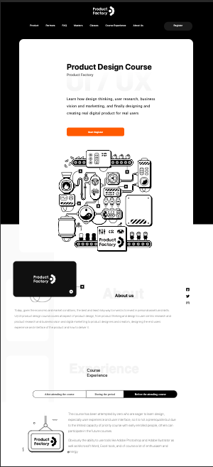

# CssPractise 
## Project was about replicating a website and producing something similar.
## Responsiveness was set as concern when reproducing the sample website.

###### Here is the different screen result I was able to design for

1. 

2. 

3. 
###### when number two has menu opened

> Design is art and at same time portrays how beautiful we see the world from within us
> I hope to do better 

